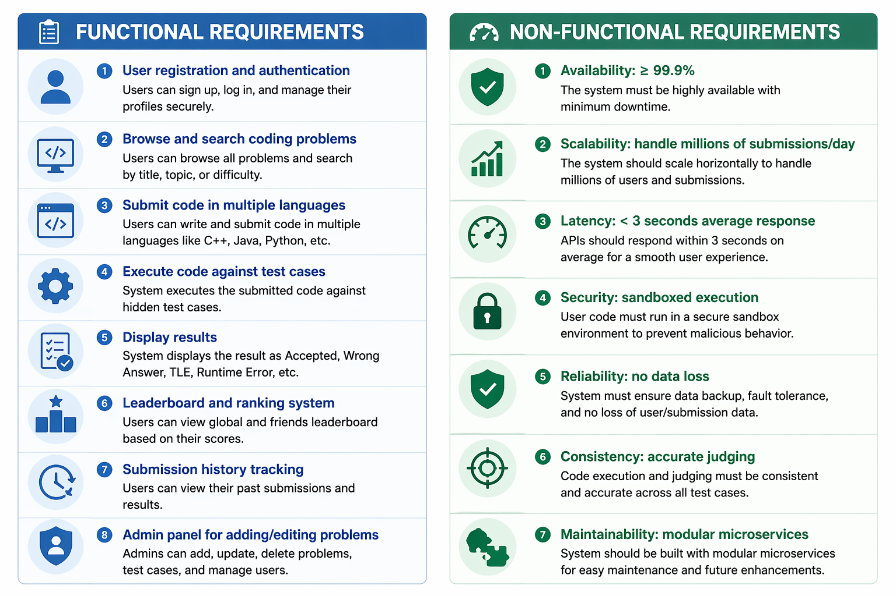

Functional Requirements
User registration and authentication
Browse and search coding problems
Submit code in multiple languages (C++, Java, Python)
Execute code against test cases
Display results (Accepted, Wrong Answer, TLE, Runtime Error)
Leaderboard and ranking system
Submission history tracking
Admin panel for adding/editing problems

Non-Functional Requirements
Availability: ≥ 99.9%
Scalability: handle millions of submissions/day
Latency: < 3 seconds average response
Security: sandboxed execution
Reliability: no data loss
Consistency: accurate judging
Maintainability: modular microservices

| Category       | Requirement       |
| -------------- | ----------------- |
| Functional     | Code submission   |
| Functional     | Problem solving   |
| Functional     | Leaderboard       |
| Non-Functional | Scalability       |
| Non-Functional | Low latency       |
| Non-Functional | High availability |

# Requirements - Online Coding Judge System

## 1. Functional Requirements

1. User Registration and Authentication  
   - Users can sign up, log in, and log out securely  
   - JWT-based authentication  

2. Problem Browsing and Search  
   - Users can view all coding problems  
   - Filter by difficulty, tags, and keywords  

3. Code Submission  
   - Users can submit code in multiple languages (C++, Java, Python)  

4. Code Execution  
   - System executes submitted code against predefined test cases  

5. Result Evaluation  
   - Display results:
     - Accepted
     - Wrong Answer
     - Time Limit Exceeded (TLE)
     - Runtime Error  

6. Submission History  
   - Users can view past submissions and results  

7. Leaderboard System  
   - Rank users based on performance  

8. Admin Panel  
   - Add/edit/delete problems  
   - Manage test cases  

---

## 2. Non-Functional Requirements

1. Availability  
   - System uptime ≥ 99.9%  

2. Scalability  
   - Must handle millions of submissions per day  
   - Horizontal scaling support  

3. Performance  
   - API response time < 3 seconds  

4. Security  
   - Code execution in sandboxed environment  
   - Prevent malicious attacks  

5. Reliability  
   - No data loss  
   - Fault-tolerant system  

6. Consistency  
   - Accurate and deterministic judging  

7. Maintainability  
   - Modular microservices architecture  
   - Easy updates and deployment  

---

## 3. Assumptions

- Users have internet access  
- Code execution environment supports multiple languages  
- Test cases are pre-defined and stored securely  

---

## 4. Constraints

- Limited execution time and memory per submission  
- High CPU usage for code execution  
- Need strong isolation for security  

---

## 5. Out of Scope

- Video tutorials  
- Social networking features  
- Real-time collaborative coding  
