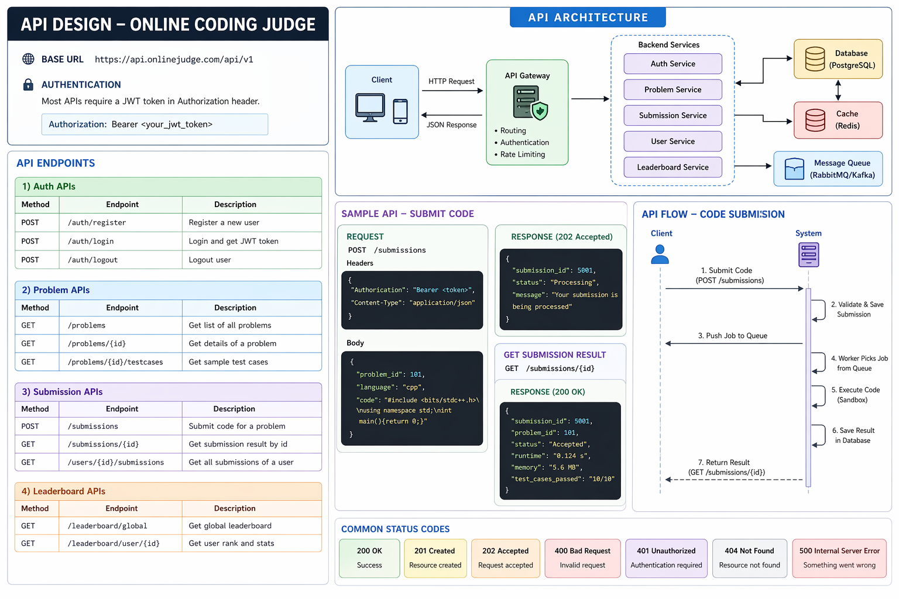
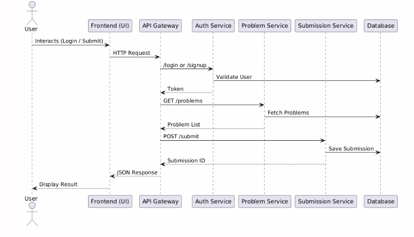

# API Design - Online Coding Judge System

## Overview
This document defines REST APIs for the Online Coding Judge system.
All APIs follow REST principles and use JSON format.

Base URL:
http://localhost:5000/api

---

## 🔐 Authentication APIs

### 1. Signup
POST /signup

Request:
{
  "name": "John Doe",
  "email": "john@example.com",
  "password": "123456"
}

Response:
{
  "message": "User registered successfully"
}

Status Codes:
200 OK
400 Bad Request

---

### 2. Login
POST /login

Request:
{
  "email": "john@example.com",
  "password": "123456"
}

Response:
{
  "token": "jwt_token_here"
}

Status Codes:
200 OK
401 Unauthorized

---

## 📘 Problem APIs

### 3. Get All Problems
GET /problems

Response:
[
  {
    "problem_id": 1,
    "title": "Two Sum",
    "difficulty": "Easy"
  }
]

---

### 4. Get Problem by ID
GET /problems/{id}

Response:
{
  "problem_id": 1,
  "title": "Two Sum",
  "description": "...",
  "difficulty": "Easy"
}

---

## 💻 Submission APIs

### 5. Submit Code
POST /submit

Request:
{
  "user_id": 1,
  "problem_id": 101,
  "language": "cpp",
  "code": "int main(){return 0;}"
}

Response:
{
  "submission_id": 5001,
  "status": "Processing"
}

---

### 6. Get Submission Result
GET /submission/{id}

Response:
{
  "submission_id": 5001,
  "status": "Accepted",
  "execution_time": 0.12
}

---

## 🏆 Leaderboard API

### 7. Get Leaderboard
GET /leaderboard

Response:
[
  {
    "user_id": 1,
    "score": 1200
  }
]

---

## ⚠️ Common Status Codes

200 → Success  
400 → Bad Request  
401 → Unauthorized  
404 → Not Found  
500 → Internal Server Error  

---