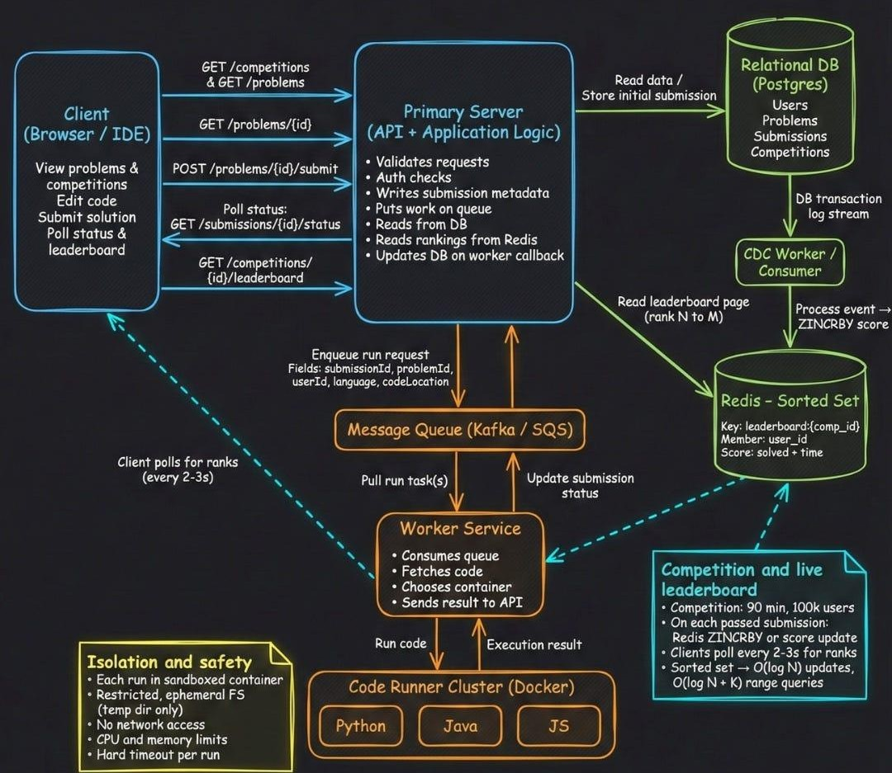

Components
1. API Gateway
Handles all incoming requests
Authentication + routing
2. Application Servers
Stateless services
Handle business logic
3. Code Execution Engine
Runs user code inside Docker containers
Enforces:
time limits
memory limits
isolation
4. Message Queue (Kafka)
Async submission processing
Prevents blocking
5. Database (PostgreSQL)
Stores persistent data
6. Cache (Redis)
Stores frequently accessed data
7. Object Storage
Stores test cases

🔁 Submission Flow
User submits code
API stores submission
Push to queue
Worker executes code
Store result
Return response

# High-Level Design - Online Coding Judge System

## 1. Overview

The Online Coding Judge system allows users to:
- Solve coding problems
- Submit solutions
- Get real-time evaluation

The system must be scalable, secure, and fault-tolerant.

---

## 2. System Architecture

The system follows a distributed microservices architecture.

### Core Components:
- Client (Web/Mobile)
- API Gateway
- Application Services
- Code Execution Engine
- Message Queue
- Database
- Cache
- Object Storage

---

## 3. Architecture Diagram

Refer to diagrams/architecture.png

---

## 4. Components Description

### 4.1 Client (Frontend)
- Web or mobile interface
- Sends API requests
- Displays results

---

### 4.2 API Gateway
- Entry point for all requests
- Handles:
  - Authentication
  - Routing
  - Rate limiting

---

### 4.3 Application Services

#### Auth Service
- Handles login/signup
- JWT authentication

#### Problem Service
- Fetch problems
- Manage problem data

#### Submission Service
- Accepts code submissions
- Sends jobs to queue

#### Leaderboard Service
- Calculates rankings

---

### 4.4 Message Queue (Kafka/RabbitMQ)
- Decouples submission and execution
- Enables asynchronous processing

---

### 4.5 Code Execution Engine

- Runs user code in isolated containers (Docker)
- Enforces:
  - Time limits
  - Memory limits
- Prevents malicious execution

---

### 4.6 Database (PostgreSQL)

Stores:
- Users
- Problems
- Submissions
- Test cases

---

### 4.7 Cache (Redis)

Caches:
- Problem list
- Leaderboard
- Frequently accessed data

---

### 4.8 Object Storage

Stores:
- Large test cases
- Files

---

## 5. Request Flow (Code Submission)

1. User submits code  
2. API Gateway receives request  
3. Submission Service stores data  
4. Job pushed to Queue  
5. Worker executes code  
6. Result stored in DB  
7. Response returned to user  

---

## 6. Key Design Decisions

### 1. Microservices Architecture
- Independent scaling
- Better maintainability

### 2. Asynchronous Processing
- Prevents blocking
- Handles high traffic

### 3. Containerized Execution
- Secure
- Isolated environment

### 4. Stateless Services
- Easy scaling

---

## 7. Advantages

- High scalability
- Fault tolerance
- Secure execution
- Low latency (with caching)

---

## 8. Limitations

- Increased complexity
- Requires monitoring
- Distributed debugging challenges
