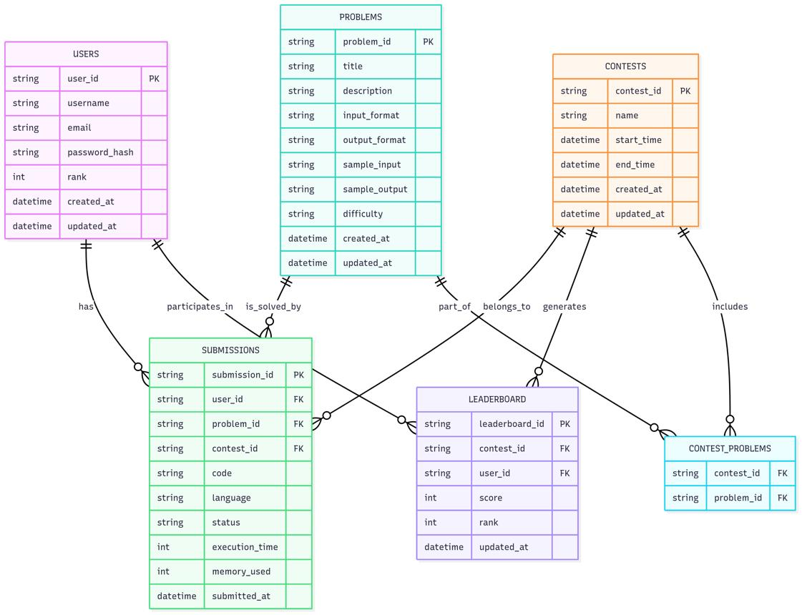
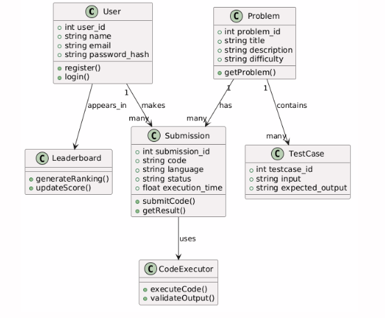
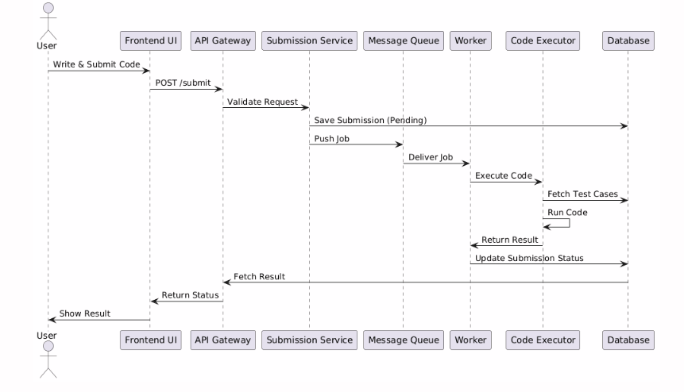

| Field         | Type      |
| ------------- | --------- |
| user_id       | INT (PK)  |
| name          | VARCHAR   |
| email         | VARCHAR   |
| password_hash | TEXT      |
| created_at    | TIMESTAMP |

| Field       | Type      |
| ----------- | --------- |
| problem_id  | INT (PK)  |
| title       | VARCHAR   |
| description | TEXT      |
| difficulty  | ENUM      |
| created_at  | TIMESTAMP |

| Field          | Type     |
| -------------- | -------- |
| submission_id  | INT (PK) |
| user_id        | INT (FK) |
| problem_id     | INT (FK) |
| code           | TEXT     |
| language       | VARCHAR  |
| status         | VARCHAR  |
| execution_time | FLOAT    |

| Field           | Type |
| --------------- | ---- |
| testcase_id     | INT  |
| problem_id      | INT  |
| input           | TEXT |
| expected_output | TEXT |


# Low-Level Design - Online Coding Judge System

## 1. Overview

This document describes the internal structure of the system, including:
- Database schema
- Entities and relationships
- Class design

---

## 2. Database Schema

### 2.1 Users Table

| Field | Type | Description |
|------|------|------------|
| user_id | INT (PK) | Unique user ID |
| name | VARCHAR | User name |
| email | VARCHAR | Unique email |
| password_hash | TEXT | Encrypted password |
| created_at | TIMESTAMP | Account creation time |

---

### 2.2 Problems Table

| Field | Type | Description |
|------|------|------------|
| problem_id | INT (PK) | Unique problem ID |
| title | VARCHAR | Problem title |
| description | TEXT | Problem statement |
| difficulty | ENUM | Easy/Medium/Hard |
| created_at | TIMESTAMP | Created time |

---

### 2.3 Submissions Table

| Field | Type | Description |
|------|------|------------|
| submission_id | INT (PK) | Unique submission ID |
| user_id | INT (FK) | References Users |
| problem_id | INT (FK) | References Problems |
| code | TEXT | Submitted code |
| language | VARCHAR | Programming language |
| status | VARCHAR | Result status |
| execution_time | FLOAT | Execution time |
| memory_used | FLOAT | Memory usage |
| created_at | TIMESTAMP | Submission time |

---

### 2.4 TestCases Table

| Field | Type | Description |
|------|------|------------|
| testcase_id | INT (PK) | Unique ID |
| problem_id | INT (FK) | Linked problem |
| input | TEXT | Input data |
| expected_output | TEXT | Expected result |

---

## 3. Entity Relationships

- One User → Many Submissions  
- One Problem → Many Submissions  
- One Problem → Many Test Cases  

---

## 4. Class Design

```cpp
class User {
public:
    int user_id;
    string name;
    string email;
    string password_hash;

    void registerUser();
    bool login();
};

class Problem {
public:
    int problem_id;
    string title;
    string description;
    string difficulty;

    void getProblem();
};

class Submission {
public:
    int submission_id;
    int user_id;
    int problem_id;
    string code;
    string language;
    string status;

    void submitCode();
    string getResult();
};

class TestCase {
public:
    int testcase_id;
    int problem_id;
    string input;
    string expected_output;
};

class CodeExecutor {
public:
    string execute(string code);
    bool validate(string output);
};

class Leaderboard {
public:
    void updateRanking();
    vector<int> getTopUsers();
};