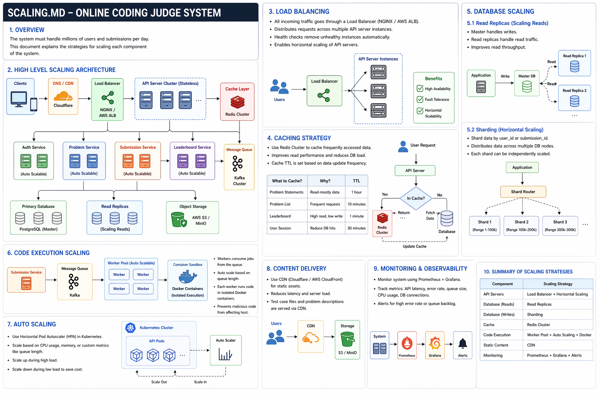

# Scaling Strategy - Online Coding Judge System

## 1. Overview

The Online Coding Judge system must handle:
- Millions of users
- High concurrent submissions
- CPU-intensive code execution

To achieve this, the system is designed using distributed and scalable architecture principles.

---

## 2. High-Level Scaling Strategy

The system follows:
- Horizontal scaling (preferred over vertical)
- Microservices architecture
- Asynchronous processing

Key idea:
Decouple components to avoid bottlenecks.

---

## 3. Load Balancing

### Approach:
- Use NGINX or AWS ELB

### Working:
- Incoming requests are distributed across multiple API servers
- Health checks remove failed servers automatically

### Benefits:
- High availability
- Fault tolerance
- Better resource utilization

---

## 4. API Server Scaling

### Strategy:
- Stateless servers

### Implementation:
- Deploy multiple instances behind load balancer

### Why:
- Easy horizontal scaling
- No session dependency

---

## 5. Caching Strategy

### Tool:
- Redis

### What to Cache:

| Data | Reason | TTL |
|------|--------|-----|
| Problem statements | Read-heavy | 1 hour |
| Problem list | Frequent access | 10 min |
| Leaderboard | High read | 1 min |
| User session | Reduce DB load | 30 min |

### Benefits:
- Reduces database load
- Improves latency

---

## 6. Database Scaling

### 6.1 Read Replicas
- Master handles writes
- Replicas handle reads

### Benefits:
- Improves read performance
- Reduces load on master

---

### 6.2 Sharding

### Strategy:
- Partition data based on:
  - user_id
  - submission_id

### Example:
- Shard 1 → users 1–100k
- Shard 2 → users 100k–200k

### Benefits:
- Handles large datasets
- Improves scalability

---

## 7. Code Execution Scaling (MOST IMPORTANT)

### Problem:
Code execution is CPU-intensive

### Solution:

1. Use Message Queue (Kafka / RabbitMQ)
2. Worker nodes process jobs asynchronously
3. Each worker runs code in Docker containers

### Flow:
- Submission → Queue → Worker → Execution → Result

### Benefits:
- Prevents API blocking
- Handles spikes in submissions
- Ensures system stability

---

## 8. Containerization

### Tool:
- Docker

### Why:
- Isolated execution
- Security (sandboxing)
- Consistent environment

---

## 9. Auto Scaling

### Tool:
- Kubernetes (HPA)

### Metrics:
- CPU usage
- Memory usage
- Queue length

### Behavior:
- Scale up during high load
- Scale down during low load

---

## 10. CDN (Content Delivery Network)

### Use:
- Serve static data:
  - problem descriptions
  - images

### Tools:
- Cloudflare / AWS CloudFront

### Benefits:
- Reduced latency
- Reduced server load

---

## 11. Monitoring & Observability

### Tools:
- Prometheus
- Grafana

### Metrics:
- API latency
- Error rate
- Queue size
- CPU usage

### Alerts:
- High error rate
- Queue backlog

---

## 12. Fault Tolerance

### Techniques:
- Retry mechanisms
- Circuit breakers
- Backup workers

---

## 13. Summary of Scaling

| Component | Strategy |
|----------|---------|
| API Servers | Load balancing + horizontal scaling |
| Database Reads | Read replicas |
| Database Writes | Sharding |
| Cache | Redis |
| Code Execution | Worker pool + queue |
| Static Content | CDN |
| Monitoring | Prometheus + Grafana |

---

## 14. Key Design Decisions (IMPORTANT FOR VIVA)

1. Asynchronous execution → prevents system blocking  
2. Stateless services → easier scaling  
3. Queue-based architecture → handles spikes  
4. Containerization → secure execution  
5. Caching → improves performance  

---

## Conclusion

The system is designed to scale horizontally, ensuring high availability, performance, and reliability even under heavy load.
